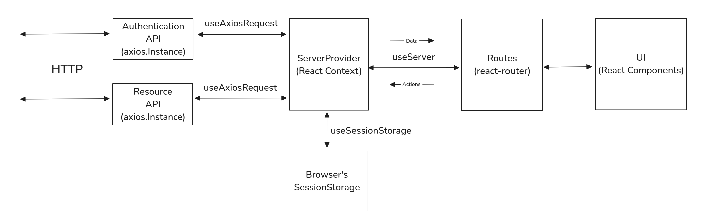
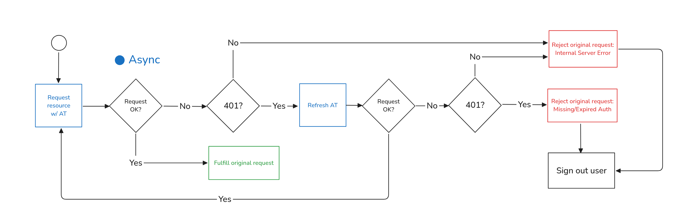
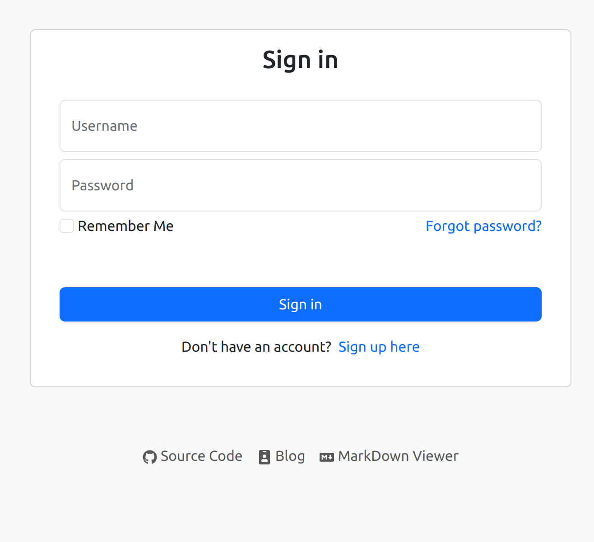
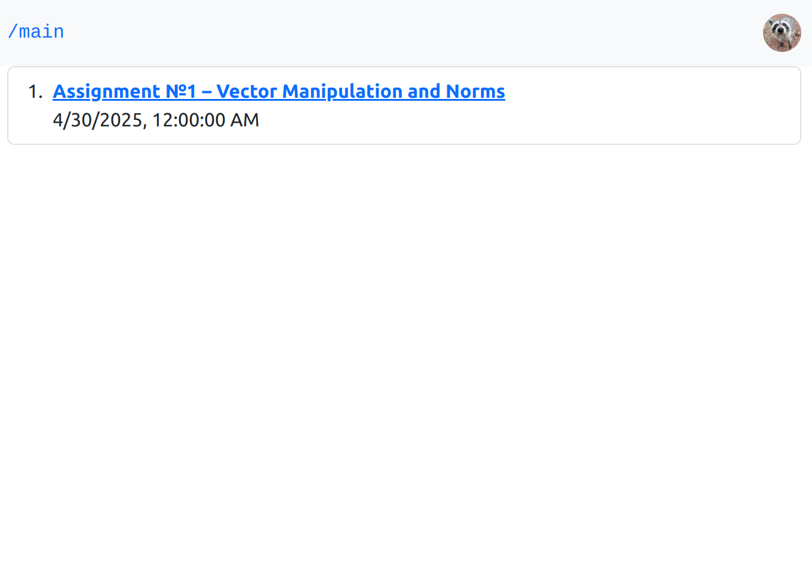
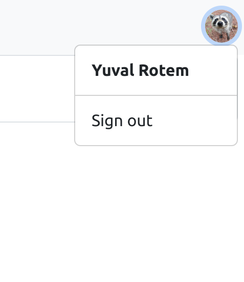
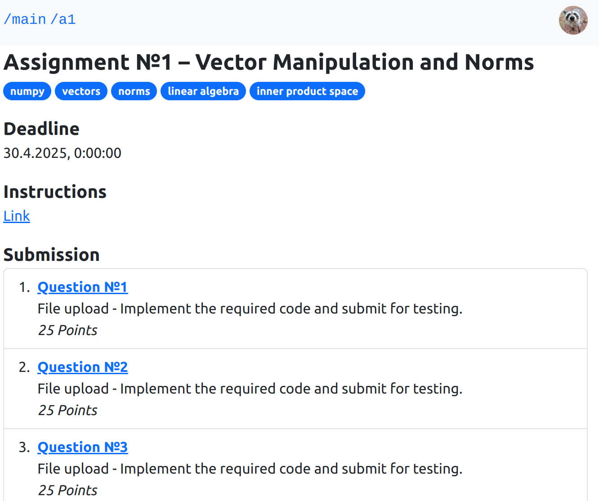
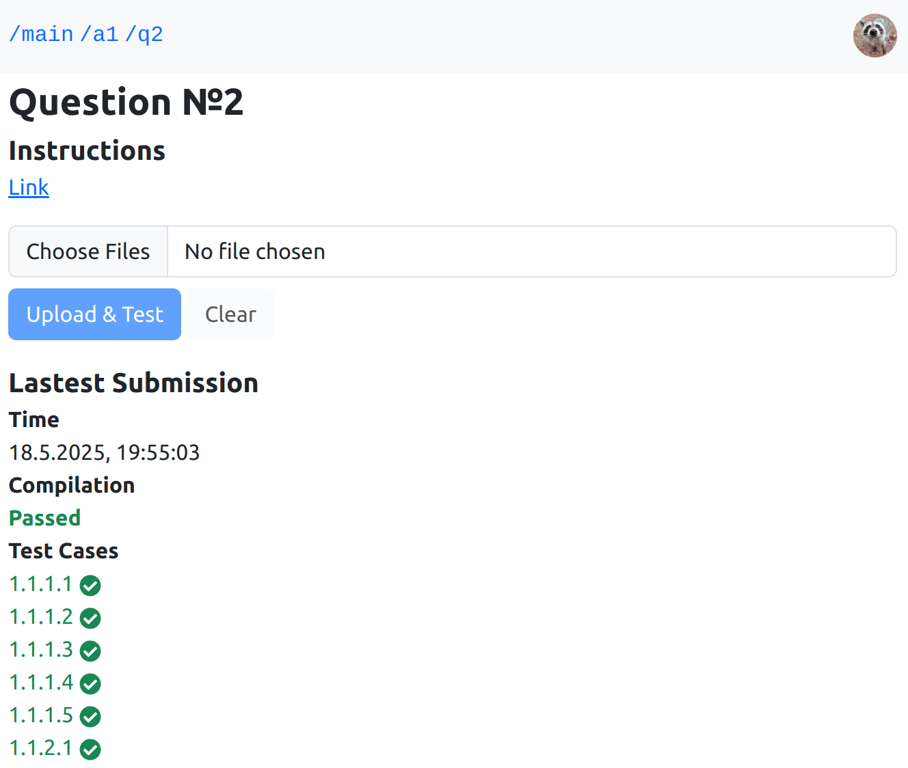

# React Frontend for Academic Assignments Testing App

#### Powered by

## About & Features
Frontend for the Academic Assignments Feedback app.  
This application provides an intuitive user interface for students and educators to manage assignments and feedback.  
It leverages React for a dynamic and responsive experience, ensuring smooth navigation and real-time updates.  
The app is styled with Bootstrap, offering a clean and modern design that enhances usability across devices.

## Overview

## JWT Authentication Startegy

## Screenshots

## Legal
Copyright (C) 2025  Yuval .R.  
This program is free software: you can redistribute it and/or modify it under the terms of the GNU General Public License as published by the Free Software Foundation, either version 3 of the License, or (at your option) any later version.  
This program is distributed in the hope that it will be useful, but WITHOUT ANY WARRANTY; without even the implied warranty of MERCHANTABILITY or FITNESS FOR A PARTICULAR PURPOSE. See the GNU General Public License for more details.  
You should have received a copy of the GNU General Public License along with this program. If not, see <http://www.gnu.org/licenses/>.
